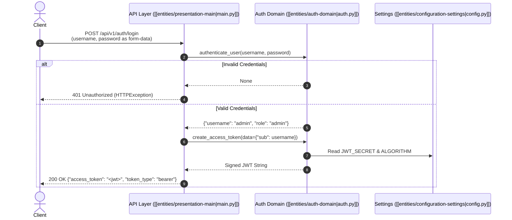

# JWT Authentication Flow

The **JWT Authentication Flow** governs how users submit credentials, how identity is verified, and how cryptographically signed, time-limited JSON Web Tokens (JWT) are constructed and issued. This flow adheres to the standard **OAuth2 Password Grant (Resource Owner Password Credentials)** flow and forms the foundation of the service's [[concepts/stateless-session-pattern|stateless session architecture]].

---

## 1. Flow Overview & Architecture

The authentication sequence spans the presentation layer in [[entities/presentation-main|src/main.py]], domain logic in [[entities/auth-domain|src/auth.py]], and configuration parameters managed in [[entities/configuration-settings|src/config.py]].



For endpoint definitions and status codes, see the [[summaries/api-reference|API Reference]]. For high-level microservice boundaries, refer to the [[summaries/architecture-overview|Architecture Overview]].

---

## 2. OAuth2 Password Flow Execution

The authentication handshake follows these sequential steps:

1. **Form-Encoded Ingestion**: The client submits a `POST` request to `/api/v1/auth/login` containing `application/x-www-form-urlencoded` fields (`username` and `password`). FastAPI parses this via `OAuth2PasswordRequestForm` (see [[decisions/fastapi-dependency-injection|FastAPI Dependency Injection]]).
2. **Credential Evaluation**: The presentation route delegates validation to `authenticate_user()` in [[entities/auth-domain|src/auth.py]]:
   ```python
   def authenticate_user(username: str, password: str):
       if username == "admin" and password == "secret123":
           return {"username": "admin", "role": "admin"}
       return None
   ```
   *(Note: For planned password hashing and database integration, see [[summaries/roadmap-and-improvements|Roadmap & Improvements]].)*
3. **Error Handling**: If `authenticate_user()` evaluates to `None`, the endpoint immediately raises an `HTTPException`:
   ```python
   raise HTTPException(
       status_code=status.HTTP_401_UNAUTHORIZED,
       detail="Incorrect username or password",
   )
   ```
4. **Token Generation**: Upon successful authentication, the route extracts the identity claim and calls `create_access_token()`.

---

## 3. Token Creation and Cryptographic Signing

The `create_access_token()` function in [[entities/auth-domain|src/auth.py]] is responsible for packaging user claims, calculating expiration timestamps, and applying symmetric digital signatures:

```python
def create_access_token(data: dict, expires_delta: timedelta = None):
    to_encode = data.copy()
    expire = datetime.utcnow() + (expires_delta or timedelta(minutes=15))
    to_encode.update({"exp": expire})
    return jwt.encode(to_encode, settings.JWT_SECRET, algorithm=settings.ALGORITHM)
```

### Signing Properties
- **Algorithm**: `HS256` (HMAC with SHA-256), configured as `settings.ALGORITHM`. See [[decisions/jwt-hs256-signing|Decision: JWT HS256 Signing]].
- **Secret Key**: Symmetrically signed using `settings.JWT_SECRET` loaded from [[entities/configuration-settings|src/config.py]] via the [[decisions/singleton-configuration|Singleton Configuration Pattern]].

---

## 4. Payload Structure & Registered Claims

The issued access token is a compact, URL-safe string composed of three base64-encoded sections separated by dots: `Header.Payload.Signature`.

### Payload Schema
The payload dictionary contains standard registered JWT claims alongside custom domain claims:

```json
{
  "sub": "admin",
  "exp": 1717171200
}
```

| Claim | Type | Description |
| :--- | :--- | :--- |
| `sub` | `string` | **Subject**: The unique identity identifier of the authenticated user (e.g., `"admin"`). |
| `exp` | `integer` (epoch) | **Expiration Time**: UTC timestamp identifying when the token expires and must no longer be accepted. |

---

## 5. Token Time-to-Live (TTL) & Lifecycle Management

Token expiration limits the attack window if an access token is intercepted:

1. **Default Duration**: If no custom `expires_delta` is supplied, `create_access_token()` defaults to a **15-minute TTL** (`timedelta(minutes=15)`).
2. **Timestamp Calculation**: The expiration date is generated by adding the TTL delta to `datetime.utcnow()`. PyJWT encodes this datetime as a Unix epoch timestamp in the `exp` claim.
3. **Downstream Verification**: When the token is subsequently passed to protected routes (such as `/api/v1/auth/me`), the [[concepts/token-verification-guard|Token Verification Guard]] automatically checks if `exp < current_time`. Expired tokens fail validation and reject the request.

---

## 6. Login Response Contract

Upon successful token generation, `/api/v1/auth/login` returns a standard OAuth2 Bearer token response:

```json
{
  "access_token": "eyJhbGciOiJIUzI1NiIsInR5cCI6IkpXVCJ9...",
  "token_type": "bearer"
}
```

The client stores this `access_token` and supplies it in subsequent requests using the `Authorization: Bearer <access_token>` HTTP header.

---

## Related References
- Cryptographic verification of issued tokens: [[concepts/token-verification-guard]]
- Stateless architecture rationale: [[concepts/stateless-session-pattern]]
- Routing implementation details: [[entities/presentation-main]]
- Core token utility functions: [[entities/auth-domain]]
- Architectural index: [[index]]