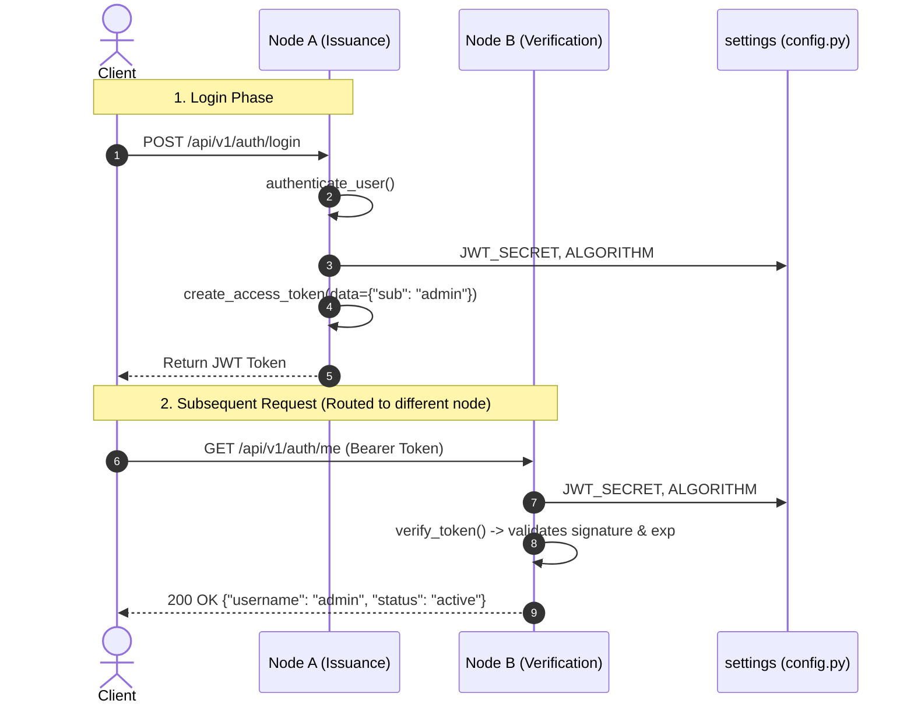

# Stateless Session Pattern

The **Stateless Session Pattern** is an architectural approach to identity management where user authentication state is not stored on the server (e.g., in a database, memory store, or distributed cache). Instead, identity claims and expiration constraints are packaged directly into cryptographically signed JSON Web Tokens ([[concepts/jwt-authentication-flow]]) that clients include with every request.

In the Mini Auth Service, this pattern is implemented across the presentation layer in [[entities/presentation-main]] and domain operations in [[entities/auth-domain]].

---

## 1. Architectural Motivation

In traditional stateful session architectures, the server generates a session ID upon login and persists session metadata in a shared data store (such as Redis or a relational database). Every incoming HTTP request requires:
1. Extracting the session ID.
2. Querying the central session store across the network.
3. Deserializing user metadata and checking expiration.

```
Stateful Architecture (Central Store Bottleneck):
[Client] ---> [Load Balancer] ---> [App Instance A] \
                                   [App Instance B] --+--> [Session Store (e.g., Redis/DB)]
                                   [App Instance C] /
```

By contrast, the **Stateless Session Pattern** removes the centralized session store dependency during request processing:

```
Stateless Architecture (Mini Auth Service):
[Client] ---> [Load Balancer] ---> [App Instance A] (Local Cryptographic Verification)
                             ---> [App Instance B] (Local Cryptographic Verification)
                             ---> [App Instance C] (Local Cryptographic Verification)
```

By offloading the storage of identity state to signed client-held tokens, the service achieves zero-lookup validation on protected routes like `/api/v1/auth/me` (see [[summaries/api-reference]]).

---

## 2. Implementation Mechanics

The stateless model relies on cryptographic integrity rather than database persistence to trust incoming data.



### Self-Contained Token Lifecycle
1. **Issuance**: When `/api/v1/auth/login` validates credentials via `authenticate_user()`, `create_access_token()` embeds claims (`sub`, `exp`) into a JWT signed with `settings.JWT_SECRET` using `HS256` (see [[decisions/jwt-hs256-signing]] and [[entities/configuration-settings]]).
2. **Transmission**: The client stores the token and supplies it in subsequent requests.
3. **Verification**: When reaching `/api/v1/auth/me`, the route's dependency injection guard `verify_token` in [[concepts/token-verification-guard]] decodes the signature using the shared secret. If the signature is valid and `exp > now()`, the claims are extracted without consulting any database or inter-process communication mechanism.

---

## 3. Horizontal Scalability Implications

The stateless session pattern directly facilitates horizontal scalability across multiple vectors:

### 3.1. Eliminating Shared State & Cache Latency
- **No Shared Session Store**: Instances do not require network I/O to a shared Redis cluster or relational database to validate a session. Token parsing is CPU-bound and executes in sub-millisecond memory time on the host instance.
- **Uniform Nodes**: Every containerized instance of the service is identical. As long as every instance shares the same `JWT_SECRET` and `ALGORITHM` (configured via [[decisions/singleton-configuration]]), any instance can verify a token issued by any other instance.

### 3.2. Load Balancer Simplicity
- Traditional session management often requires **session affinity** ("sticky sessions") at the reverse proxy or load balancer level to route users to the specific instance holding their in-memory session.
- With stateless tokens, load balancers can distribute traffic using simple round-robin, least-connections, or geographical routing algorithms without risking session disruption.

### 3.3. Dynamic Auto-Scaling
- Instances can scale out (spin up) or scale in (terminate) instantaneously based on load metrics without needing session re-balancing, data migration, or cache warming.

---

## 4. Trade-Offs and Architectural Considerations

While stateless sessions offer scalability benefits, they introduce distinct trade-offs:

| Characteristic | Stateless Token Architecture | Stateful Session Architecture |
| :--- | :--- | :--- |
| **Server Memory / Storage** | Zero server-side session memory. | Session storage proportional to active user count. |
| **I/O Overhead per Request** | Zero database / cache lookups. | Network call required to check session store. |
| **Revocation Capability** | Difficult; tokens remain valid until expiration (`exp`). | Instantaneous; delete session ID from store. |
| **Bandwidth Overhead** | Higher (JWT strings sent on every request). | Lower (compact session ID strings). |
| **Secret Management** | High dependency on secure secret synchronization across nodes. | Secret resides within backend network boundary. |

### Mitigations in the Mini Auth Service
1. **Short Token Lifetimes (TTL)**: Tokens are configured by default to expire in 15 minutes (`timedelta(minutes=15)`), narrowing the window of vulnerability if a token is compromised or permissions change.
2. **Dependency-Driven Verification**: Encapsulating verification inside FastAPI dependencies ([[decisions/fastapi-dependency-injection]]) allows swapping or augmenting verification logic (such as checking a token revocation list) without modifying individual endpoint handlers.

---

## 5. Related Architecture & Future Roadmap

- [[concepts/jwt-authentication-flow]]: Details the token structure, claim generation, and issuance lifecycle.
- [[concepts/token-verification-guard]]: Explains how incoming tokens are cryptographically evaluated.
- [[summaries/roadmap-and-improvements]]: Highlights future enhancements, such as distributed token revocation lists and refresh token flows.
- [[entities/auth-domain]]: Implementation source for `create_access_token` and `verify_token`.
- [[entities/presentation-main]]: Entry points consuming stateless session tokens.