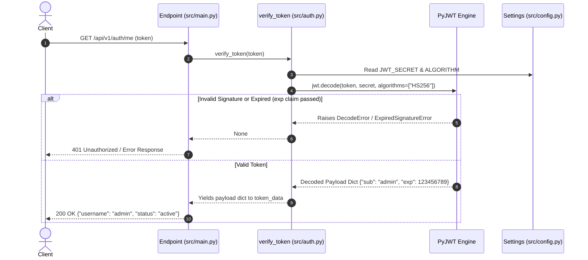

# Token Verification Guard

The **Token Verification Guard** is the core perimeter security mechanism within the [[summaries/architecture-overview|Mini Auth Service]]. It intercepts incoming HTTP requests to protected endpoints, parses and cryptographically validates JSON Web Tokens (JWTs), checks token expiration, and injects validated identity claims directly into route handlers.

This pattern enforces a [[concepts/stateless-session-pattern|stateless session architecture]], ensuring that protected endpoints verify caller identity without relying on server-side session stores or database lookups.

---

## 1. Architectural Role & Flow

The verification guard acts as an authorization boundary between the presentation layer ([[entities/presentation-main|src/main.py]]) and the underlying cryptographic business logic in the domain layer ([[entities/auth-domain|src/auth.py]]). 

Protected routes declare the guard as a dependency using [[decisions/fastapi-dependency-injection|FastAPI dependency injection (`Depends`)]]. When a request hits a protected route such as `GET /api/v1/auth/me`, FastAPI executes the dependency prior to executing the endpoint handler.



---

## 2. Core Guard Mechanics

The guard operates across three distinct stages: parameter reception, cryptographic decoding, and claim injection.

### 2.1 Cryptographic Validation (`src/auth.py`)

The function `verify_token` in [[entities/auth-domain|src/auth.py]] encapsulates the verification logic:

```python
def verify_token(token: str):
    try:
        payload = jwt.decode(token, settings.JWT_SECRET, algorithms=[settings.ALGORITHM])
        return payload
    except Exception:
        return None
```

During `jwt.decode`:
1. **Signature Verification**: PyJWT validates the token's cryptographic signature against `settings.JWT_SECRET` using the [[decisions/jwt-hs256-signing|HS256 symmetric algorithm]] defined in [[entities/configuration-settings|src/config.py]].
2. **Claim Verification (`exp`)**: PyJWT automatically inspects the standard `exp` (expiration) timestamp claim encoded during [[concepts/jwt-authentication-flow|token creation]]. If the current UTC time is past `exp`, verification fails.
3. **Exception Handling**: Any validation failure (e.g., token tampering, algorithm mismatch, malformed base64, or expired TTL) triggers an exception caught by the guard, returning `None`.

### 2.2 Route Guard Injection (`src/main.py`)

In [[entities/presentation-main|src/main.py]], protected endpoints specify `verify_token` via `Depends()`:

```python
@app.get("/api/v1/auth/me")
async def get_current_user(token_data: dict = Depends(verify_token)):
    return {"username": token_data["sub"], "status": "active"}
```

When an endpoint executes:
- FastAPI resolves `verify_token`, passing the inbound token parameter.
- The returned dictionary payload (containing the identity subject `sub`) is injected directly into `token_data`.
- Downstream logic extracts `token_data["sub"]` to identify the authenticated caller without re-parsing credentials.

---

## 3. Security Considerations & Error Handling

| Concern | Implementation Mechanism | Architectural Impact |
| :--- | :--- | :--- |
| **Tamper Resistance** | Symmetric HMAC signature verification (`HS256`) using `settings.JWT_SECRET`. | Guarantees that claims (such as identity `sub` or user roles) cannot be modified in transit by the client or intermediaries. |
| **Replay Attack Mitigation** | Standard `exp` claim validation checked on every request. | Restricts token validity to the TTL window set during issuance (default 15 minutes). |
| **Decoupled Architecture** | Enforced via FastAPI's `Depends` injection model. | Decouples cryptographic decoding logic from HTTP presentation routes, simplifying testing and maintenance. |

---

## 4. Current Limitations & Roadmap

As outlined in [[summaries/roadmap-and-improvements]], the current token verification implementation has specific areas targeted for future refinement:

1. **HTTP Bearer Extraction**:
   - *Current*: `verify_token` expects the token string to be extracted directly from endpoint parameters.
   - *Target*: Integrate FastAPI's `OAuth2PasswordBearer(tokenUrl="...")` scheme to automatically inspect the `Authorization: Bearer <token>` HTTP header and automatically return a standard `401 Unauthorized` with `WWW-Authenticate: Bearer` headers on missing tokens.
2. **Granular Exception Handling**:
   - *Current*: `verify_token` absorbs all exceptions with a broad `except Exception:` block and returns `None`.
   - *Target*: Explicitly catch `jwt.ExpiredSignatureError` and `jwt.InvalidTokenError`, raising distinct `HTTPException(status_code=401, detail=...)` responses with actionable error diagnostics.
3. **Role & Permission Guards**:
   - *Target*: Extend the dependency guard pattern to inspect custom role claims (e.g., `role: "admin"`) for granular Role-Based Access Control (RBAC).

---

## 5. Related Documentation

- [[concepts/jwt-authentication-flow]] — Token generation, payload composition, and issuance lifecycle.
- [[concepts/stateless-session-pattern]] — Architectural context on stateless authentication.
- [[decisions/fastapi-dependency-injection]] — Design decision detailing the use of FastAPI dependencies for route guards.
- [[decisions/jwt-hs256-signing]] — Cryptographic design rationale for HS256 symmetric signing.
- [[summaries/api-reference]] — Specifications for protected endpoints using this guard.