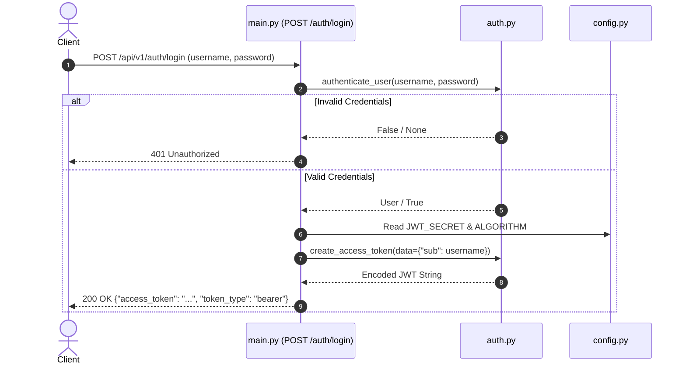
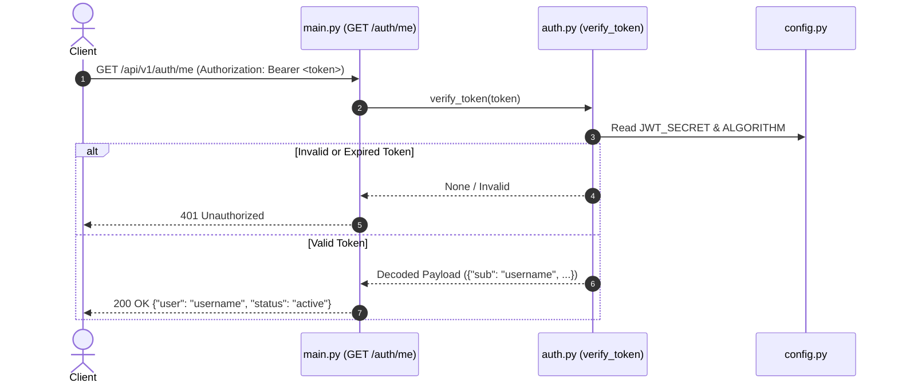

# Architectural Summary: Mini Auth Service

The **Mini Auth Service** is a lightweight, stateless microservice engineered to provide authentication and token lifecycle management. Built on **FastAPI** and **PyJWT**, the service implements the standard OAuth2 Password Flow to verify client credentials and issue cryptographically signed JSON Web Tokens (JWT).

---

## 1. High-Level Architecture

The service adopts a clean, layered architecture separating HTTP routing, authentication business logic, and runtime configuration.

```
                  +-----------------------------------+
                  |           Client / SPA            |
                  +-----------------+-----------------+
                                    |
                 HTTP POST (Login)  |  HTTP GET (Bearer Token)
                                    v
+-----------------------------------------------------------------------+
|  Presentation & API Routing Layer (`src/main.py`)                   |
|                                                                       |
|   POST /api/v1/auth/login                 GET /api/v1/auth/me         |
|         |                                      |                      |
|         v                                      v                      |
+---------+--------------------------------------+----------------------+
|  Authentication Domain Layer (`src/auth.py`)                        |
|                                                                       |
|   +-----------------------+     +-------------------------------+     |
|   |   authenticate_user   |     |  verify_token                 |     |
|   +-----------------------+     +-------------------------------+     |
|   |   create_access_token |                                           |
|   +-----------------------+                                           |
+-----------------------------------------------------------------------+
                                    ^
                                    | Reads Config
+-----------------------------------+-----------------------------------+
|  Configuration Layer (`src/config.py`)                              |
|   - JWT_SECRET, ALGORITHM, DATABASE_URL                               |
+-----------------------------------------------------------------------+
```

---

## 2. Component Decomposition

The codebase is organized into three primary modules:

| Component / File | Layer | Responsibilities | Key Symbols / Endpoints |
| :--- | :--- | :--- | :--- |
| `src/main.py` | Presentation / API | Route definition, request parsing, HTTP response/status generation, and dependency injection guards. | `POST /api/v1/auth/login`<br>`GET /api/v1/auth/me` |
| `src/auth.py` | Domain Logic | Credential validation, token payload construction, cryptographic signing (HS256), and signature/expiration validation. | `authenticate_user()`<br>`create_access_token()`<br>`verify_token()` |
| `src/config.py` | Configuration | Centralized settings, token parameters, encryption algorithms, and external connection strings. | `Settings`<br>`settings` singleton |

### 2.1. Presentation Layer (`src/main.py`)
Exposes the REST API using FastAPI. It utilizes FastAPI's built-in dependency injection system (`Depends`) to:
- Ingest and validate form-encoded credentials via `OAuth2PasswordRequestForm`.
- Intercept incoming requests on protected endpoints (`/api/v1/auth/me`) using `verify_token` to validate caller claims prior to route execution.

### 2.2. Domain Layer (`src/auth.py`)
Encapsulates token mechanics and credential evaluation:
- **`authenticate_user`**: Validates incoming username and password combinations.
- **`create_access_token`**: Packages identity claims (`sub`) alongside an expiration timestamp (`exp`), producing signed tokens with a default 15-minute Time-to-Live (TTL).
- **`verify_token`**: Decodes and verifies inbound JWTs against the configured secret and algorithm, returning the decoded payload or handling expiration/signature errors safely.

### 2.3. Configuration Layer (`src/config.py`)
Provides application-wide constants via the `Settings` class:
- `JWT_SECRET`: The symmetric signing key used for token operations.
- `ALGORITHM`: Token signing standard (`HS256`).
- `DATABASE_URL`: Target database connection string for persistence layers.

---

## 3. Core Data & Request Flows

### 3.1. Authentication & Token Issuance Flow


### 3.2. Protected Endpoint Verification Flow


---

## 4. Key Architectural Patterns

1. **Stateless Session Management**: Authentication is fully contained within signed JWTs. Because state is not maintained in memory or server-side sessions, the service can scale horizontally behind a load balancer without shared session infrastructure.
2. **Dependency Injection (DI)**: FastAPI dependencies are used for decoupling security policies and token validation routines from endpoint business logic.
3. **Singleton Configuration**: Application settings are initialized once and referenced globally to ensure uniform cryptographic configurations.

---

## 5. Architectural Roadmap & Recommended Improvements

| Area | Current State | Production Target |
| :--- | :--- | :--- |
| **Secrets Management** | `JWT_SECRET` is statically configured in `src/config.py`. | Migrate to `pydantic-settings` to dynamically load secrets from environment variables or a key vault. |
| **Persistence & Hashing** | Static/mock credential checks in `src/auth.py`. | Integrate an ORM (e.g., SQLAlchemy/SQLModel) connected to `DATABASE_URL` with secure password hashing (`bcrypt`/`argon2`). |
| **Token Extraction** | Direct parameter binding in `src/main.py`. | Implement FastAPI's `OAuth2PasswordBearer` scheme to standardize HTTP `Authorization: Bearer` extraction and error signaling. |