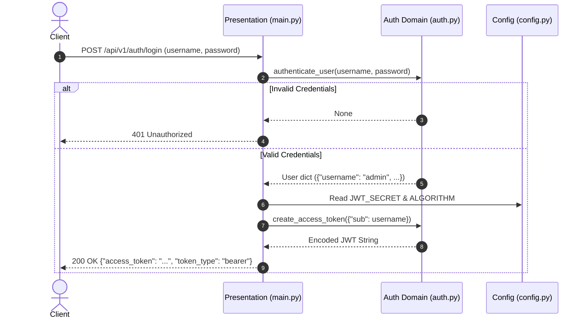
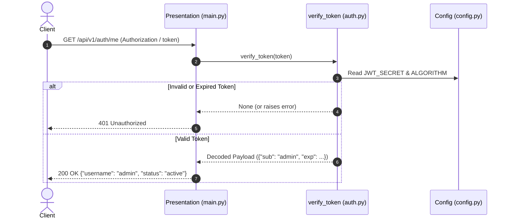

<!-- anchor: src/auth.py:L1-L100 sha:HEAD -->

# Architecture Overview

The **Mini Auth Service** is a lightweight, stateless authentication microservice built with **FastAPI** and **PyJWT**. It provides credential verification and token lifecycle management using the standard OAuth2 Password Flow and cryptographically signed JSON Web Tokens (JWT).

For entry-level navigation, refer to the [[index]].

---

## 1. High-Level System Architecture

The service follows a layered architectural design separating HTTP presentation and request parsing, core authentication business logic, and centralized runtime configuration.

```
                  +-----------------------------------+
                  |           Client / SPA            |
                  +-----------------+-----------------+
                                    |
                 HTTP POST (Login)  |  HTTP GET (Bearer Token)
                                    v
+-----------------------------------------------------------------------+
|  Presentation & API Routing Layer ([[entities/presentation-main]])     |
|                                                                       |
|   POST /api/v1/auth/login                 GET /api/v1/auth/me         |
|         |                                      |                      |
|         v                                      v                      |
+---------+--------------------------------------+----------------------+
|  Authentication Domain Layer ([[entities/auth-domain]])               |
|                                                                       |
|   +-----------------------+     +-------------------------------+     |
|   |   authenticate_user   |     |  verify_token                 |     |
|   +-----------------------+     +-------------------------------+     |
|   |   create_access_token |                                           |
|   +-----------------------+                                           |
+-----------------------------------------------------------------------+
                                    ^
                                    | Reads Settings
+-----------------------------------+-----------------------------------+
|  Configuration Layer ([[entities/configuration-settings]])            |
|   - JWT_SECRET, ALGORITHM, DATABASE_URL                               |
+-----------------------------------------------------------------------+
```

---

## 2. Module Decomposition & Component Responsibilities

The codebase is organized into three distinct components:

| Component | Source File | Layer | Primary Responsibilities |
| :--- | :--- | :--- | :--- |
| [[entities/presentation-main]] | `src/main.py` | Presentation / API | Route definition, form parsing, HTTP error response formatting, and parameter injection. |
| [[entities/auth-domain]] | `src/auth.py` | Domain Logic | Credential authentication, token payload creation, signature generation, and JWT validation. |
| [[entities/configuration-settings]] | `src/config.py` | Configuration | Application settings, encryption algorithms, secret keys, and database connection strings. |

### 2.1. Presentation Layer (`src/main.py`)
Implemented in `src/main.py` (see [[entities/presentation-main]]), this layer handles HTTP ingress using FastAPI. It leverages [[decisions/fastapi-dependency-injection]] to:
- Bind and parse form credentials via `OAuth2PasswordRequestForm` on the login route.
- Intercept incoming calls on protected endpoints (`GET /api/v1/auth/me`) via the `verify_token` dependency guard.
- Map domain outcomes to HTTP status codes (such as `401 Unauthorized` via `HTTPException`).
- Detailed route contracts are documented in the [[summaries/api-reference]].

### 2.2. Authentication Domain Layer (`src/auth.py`)
Implemented in `src/auth.py` (see [[entities/auth-domain]]), this layer contains the core security logic:
- `authenticate_user(username, password)`: Evaluates user credentials.
- `create_access_token(data, expires_delta)`: Constructs JWT claims including `sub` and `exp` timestamps, signing the token using symmetric [[decisions/jwt-hs256-signing]].
- `verify_token(token)`: Decodes and verifies token signatures and expiration timestamps, returning the payload or failing safely.

### 2.3. Configuration Layer (`src/config.py`)
Implemented in `src/config.py` (see [[entities/configuration-settings]]), this layer instantiates a single `Settings` object following the [[decisions/singleton-configuration]] pattern:
- `JWT_SECRET`: Symmetric encryption key used for token signing and validation.
- `ALGORITHM`: Set to `"HS256"`.
- `DATABASE_URL`: Connection string configured for future persistence layers.

---

## 3. Core Request Workflows

### 3.1. Authentication and Token Issuance Flow
The login workflow follows the standard OAuth2 Password grant mechanism. See [[concepts/jwt-authentication-flow]] for full details on payload structures and token lifetimes.



### 3.2. Protected Endpoint Verification Flow
Protected routes validate incoming Bearer tokens using route-level dependency guards. See [[concepts/token-verification-guard]] for token parsing mechanics.



---

## 4. Key Architectural Patterns & Decisions

1. **[[concepts/stateless-session-pattern]]**: Authentication state is encapsulated entirely within signed JWTs. Because no session state is maintained in server memory, service instances can scale horizontally behind a load balancer without sticky sessions.
2. **[[decisions/fastapi-dependency-injection]]**: Decouples security verification routines (`verify_token`) from the route handler logic, ensuring clean separation of concerns and reusable guards across endpoints.
3. **[[decisions/jwt-hs256-signing]]**: Uses symmetric HMAC SHA-256 for signing tokens, providing high-performance cryptographic verification suitable for single-service environments.
4. **[[decisions/singleton-configuration]]**: Centralizes application parameters into an immutable global `settings` object, ensuring consistent cryptographic secrets and algorithms across modules.

---

## 5. Architectural Evolution & Next Steps

For an in-depth breakdown of technical debt, persistence integration, and security hardening, see [[summaries/roadmap-and-improvements]]. Key planned enhancements include:
- Migrating from static credentials to database persistence with secure password hashing (`argon2` or `bcrypt`).
- Transitioning `Settings` to `pydantic-settings` to pull secrets dynamically from environment variables.
- Standardizing token extraction using FastAPI's `OAuth2PasswordBearer`.