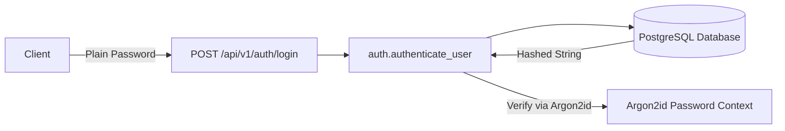

<!-- anchor: src/auth.py:L1-L100 sha:HEAD -->

# Roadmap and Production Improvements

This document outlines the architectural enhancements, security upgrades, and operational hardening required to evolve the **Mini Auth Service** from its current proof-of-concept design into an enterprise-grade, production-ready authentication service.

---

## 1. Overview of Current vs. Target State

As documented in the [[summaries/architecture-overview]], the service demonstrates core [[concepts/jwt-authentication-flow|JWT authentication flows]] and [[concepts/stateless-session-pattern|stateless session management]]. However, several mock implementations and static configurations must be replaced before production deployment.

```
+-------------------------------------------------------------------------------+
|                             CURRENT STATE (MVP)                               |
+-----------------------+-----------------------------+-------------------------+
| Static In-Memory Auth | Hardcoded Secret Constants  | Simple Parameter Guard  |
| ("admin"/"secret123") | ([[entities/configuration-settings]]) | ([[entities/presentation-main]])|
+-----------------------+-----------------------------+-------------------------+
                                    |
                                    v
+-------------------------------------------------------------------------------+
|                           TARGET PRODUCTION STATE                             |
+-----------------------+-----------------------------+-------------------------+
| DB + Argon2/Bcrypt    | Dynamic Secrets / Vault     | OAuth2PasswordBearer    |
| Persistence Layer     | (pydantic-settings)         | Token Revocation/Redis  |
+-----------------------+-----------------------------+-------------------------+
```

---

## 2. Dynamic Secrets & Configuration Management

### Current Implementation
Currently, [[entities/configuration-settings]] initializes secrets as static class attributes within `src/config.py`:
- `JWT_SECRET` is hardcoded as `"astrophage-secret-key-123"`.
- Configuration adheres to a basic [[decisions/singleton-configuration|singleton pattern]] without environment variable parsing or rotation capabilities.

### Target Architecture
1. **Migration to `pydantic-settings`**:
   Replace the plain class definition with Pydantic's `BaseSettings` to enforce type safety, support `.env` files, and automatically parse OS environment variables.
   ```python
   from pydantic_settings import BaseSettings

   class Settings(BaseSettings):
       JWT_SECRET: str
       ALGORITHM: str = "HS256"
       DATABASE_URL: str
       ACCESS_TOKEN_EXPIRE_MINUTES: int = 15

       class Config:
           env_file = ".env"
           case_sensitive = True
   ```
2. **Secret Rotation & Vault Integration**:
   - Integrate dynamic secret retrieval from secret management services (e.g., AWS Secrets Manager, HashiCorp Vault, Azure Key Vault).
   - Support multiple active verification keys to allow zero-downtime key rotation.

---

## 3. Password Hashing & Persistence Layer

### Current Implementation
In [[entities/auth-domain]], credential validation is performed via synchronous string comparison:
```python
def authenticate_user(username: str, password: str):
    if username == "admin" and password == "secret123":
        return {"username": "admin", "role": "admin"}
    return None
```
This is vulnerable to timing attacks and lacks real user persistence.

### Target Architecture
1. **Cryptographic Password Hashing**:
   - Integrate industry-standard slow hashing algorithms such as **Argon2id** (recommended) or **Bcrypt** with salt generation (using `passlib` or `pwdlib`).
   - Eliminate plain-text credential handling across all layers.
2. **Database Persistence (ORM Integration)**:
   - Connect the service to PostgreSQL using an asynchronous ORM (e.g., **SQLAlchemy 2.0 Async** or **SQLModel**), utilizing the `DATABASE_URL` defined in [[entities/configuration-settings]].
   - Implement repository patterns to decouple data queries from [[entities/auth-domain]].



---

## 4. OAuth2 Protocol Conformance & Token Guarding

### Current Implementation
In [[entities/presentation-main]], the protected endpoint `/api/v1/auth/me` relies directly on passing a raw string or token dictionary into `verify_token`:
```python
@app.get("/api/v1/auth/me")
async def get_current_user(token_data: dict = Depends(verify_token)):
    return {"username": token_data["sub"], "status": "active"}
```
Additionally, `verify_token` catches all exceptions broadly and returns `None`, which does not automatically raise standard HTTP 401 exceptions within FastAPI's dependency chain unless explicitly checked.

### Target Architecture
1. **`OAuth2PasswordBearer` Integration**:
   - Utilize FastAPI's `OAuth2PasswordBearer(tokenUrl="/api/v1/auth/login")` scheme.
   - Automatically extract bearer tokens from the standard `Authorization: Bearer <token>` HTTP header.
   - Automatically populate OpenAPI / Swagger UI authentication metadata for [[summaries/api-reference]].
2. **Standardized [[concepts/token-verification-guard|Token Verification Guard]]**:
   - Raise explicit `HTTPException(status_code=401, detail=...)` on token expiry (`jwt.ExpiredSignatureError`) or tampering (`jwt.InvalidTokenError`).
   - See [[decisions/fastapi-dependency-injection]] for architectural rationale on route-level guards.

---

## 5. Token Lifecycle, Revocation & Asymmetric Signing

### Token Revocation & Refresh Tokens
- **Short-Lived Access Tokens + Refresh Tokens**: Issue 15-minute access tokens alongside long-lived refresh tokens (e.g., 7 days) stored securely in HTTP-only cookies.
- **Revocation / Blacklisting**: Although the service follows the [[concepts/stateless-session-pattern]], immediate logout and credential invalidation require a lightweight, distributed cache (e.g., Redis) to track revoked JWT IDs (`jti`).

### Cryptographic Evolution: Symmetric vs. Asymmetric Signing
Currently, the service utilizes symmetric [[decisions/jwt-hs256-signing|HS256 signing]]. As the system expands into a distributed microservice ecosystem:
- **Transition to RS256 or ES256**: Migrate to asymmetric signing (Public/Private key pairs).
- **Public Key Distribution**: Downstream microservices can verify access tokens using a public `jwks.json` endpoint without knowing the private key used by the Mini Auth Service.

---

## 6. Comprehensive Improvement Matrix

| Capability | Current State ([[summaries/architecture-overview]]) | Production Target | Priority |
| :--- | :--- | :--- | :--- |
| **Secrets Engine** | Static string in [[entities/configuration-settings]] | `pydantic-settings` + Vault / Environment variables | High |
| **Password Storage** | Plaintext check in [[entities/auth-domain]] | Argon2id / Bcrypt via `pwdlib` or `passlib` | Critical |
| **Persistence Layer** | In-memory mock | PostgreSQL via Async SQLAlchemy / Alembic migrations | Critical |
| **Bearer Scheme** | Parameter injection in [[entities/presentation-main]] | Standard `OAuth2PasswordBearer` with header parsing | High |
| **Error Signaling** | Broad try/except returning `None` in `verify_token` | Explicit 401 HTTP errors with RFC 6750 challenge headers | High |
| **Cryptographic Scheme**| Symmetric [[decisions/jwt-hs256-signing|HS256]] | Asymmetric RS256/ES256 with JWKS exposure | Medium |
| **Session Control** | Pure stateless without revocation | Refresh tokens + Redis token blocklist | Medium |
| **Rate Limiting** | None | SlowAPI / Redis-backed brute-force mitigation on login | High |

---

## 7. Related Documentation

- [[index]] — System entry point and architecture map
- [[summaries/architecture-overview]] — Component boundaries and current service architecture
- [[summaries/api-reference]] — API specifications and HTTP contract details
- [[decisions/jwt-hs256-signing]] — Evaluation of token signing mechanics
- [[decisions/singleton-configuration]] — Current configuration management pattern